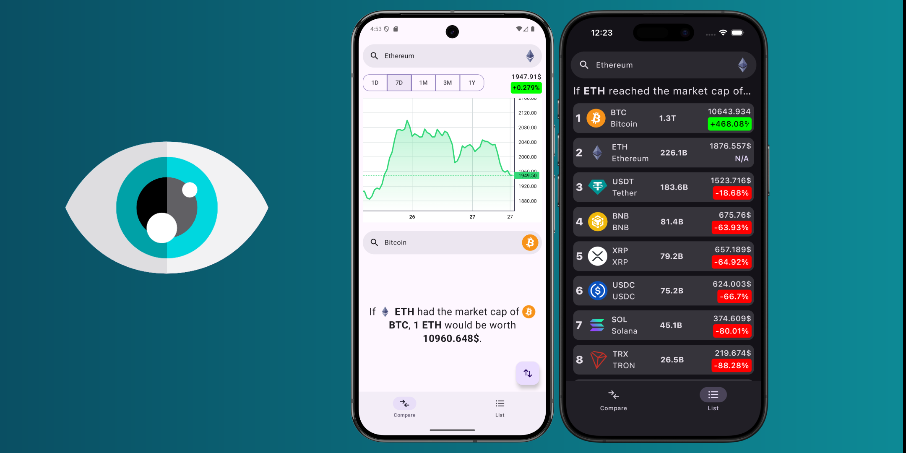

<h1>CoinVision</h1>

## About
**CoinVision** is a Compose Multiplatform app that allows users to envision one token with the market cap of another. It utilizes the [CoinGecko API](https://www.coingecko.com/en/api) (currently its free tier has very restrictive usage limits).

## Features
- **Direct 1:1 token comparison** with a relevant **chart**
- **Token list** for a comparison with a wide range of tokens

## Used technologies
- [Kamel](https://github.com/Kamel-Media/Kamel) – image loading
- [Koin](https://insert-koin.io/) – dependency injection
- [Coroutines](https://kotlinlang.org/docs/coroutines-guide.html) - asynchronous/concurrent programming
- [Ktor](https://ktor.io/) – networking
- [Compose Shimmer](https://github.com/valentinilk/compose-shimmer) – loading placeholders
- [SQLDelight](https://cashapp.github.io/sqldelight/) – local database
- [TradingView Lightweight Charts](https://www.tradingview.com/lightweight-charts/) – token price charts
- [Voyager](https://voyager.adriel.cafe/) – navigation
